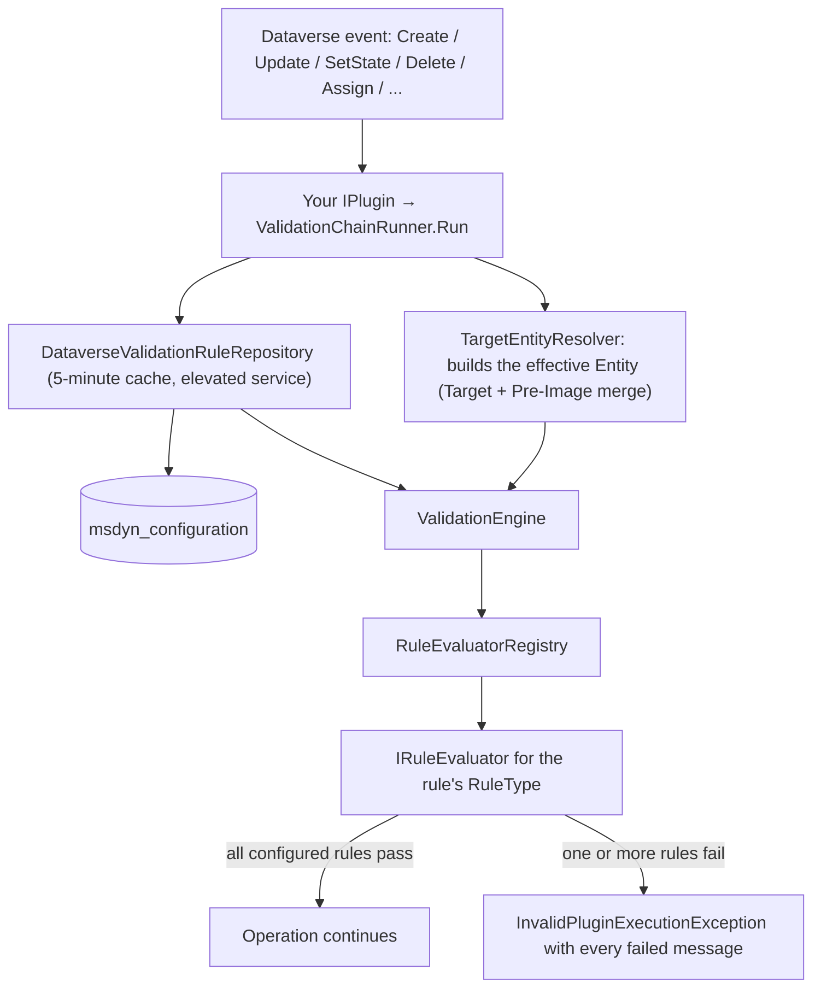

# DevEn.Xrm.EntityValidation

A generic, configuration-driven Dataverse plugin that validates any entity's data against rules stored
in Dataverse itself, with no entity-specific code and no redeployment required to add, change or disable a rule.

**At a glance**

| | |
|---|---|
| Target framework | .NET Framework 4.6.2 (`net462`) — the supported Dataverse plugin sandbox target |
| Configuration storage | Out-of-the-box `msdyn_configuration` ("Configuration") table |
| Built-in rule types | 12 (see [Rule type reference](#rule-type-reference)) |
| Configuration granularity | One JSON array per target entity, one object per rule (field/message/stage/type/parameters) |
| Authoring | Excel template + generator driven by `app.config`: fill the sheet, run the tool, get the configuration rows |
| Missing configuration | Silently skipped (no rules configured = no validation, not an error) |
| Broken configuration | Fails loudly with a clear error (malformed JSON is a real mistake to fix) |
| Packaging | Shared project (`.shproj`): the sources compile into your own plugin assembly, no extra DLL to deploy |
| Entry point | `Execution.ValidationChainRunner` (pipeline) and `Execution.OnDemandValidationRunner` (Custom API / "Validate" button) — both called from an `IPlugin` class you declare |

## Table of contents

- [Overview](#overview)
- [Architecture](#architecture)
- [Configuration model](#configuration-model)
- [Generating the configuration from a spreadsheet](#generating-the-configuration-from-a-spreadsheet)
- [Rule type reference](#rule-type-reference)
- [Supported Dataverse messages and pipeline stages](#supported-dataverse-messages-and-pipeline-stages)
- [Using it in your plugin assembly](#using-it-in-your-plugin-assembly)
- [Validating on demand (Custom API)](#validating-on-demand-custom-api)
- [Error handling and validation messages](#error-handling-and-validation-messages)
- [Caching](#caching)
- [Security model](#security-model)
- [Extending: adding a new rule type](#extending-adding-a-new-rule-type)
- [Solution structure](#solution-structure)
- [Requirements](#requirements)
- [Building and testing](#building-and-testing)

## Overview

Traditionally, validating a Dataverse entity's fields means writing (and maintaining, and redeploying) a
dedicated plugin per entity. `DevEn.Xrm.EntityValidation` replaces that with a single validation chain
that you register once per entity/message/stage combination and that reads *what* to validate from a
Dataverse configuration row at execution time.

Design principles:

- **No entity-specific code.** The same code and the same plugin class validate every entity; only
  the configuration changes.
- **Configuration lives in Dataverse**, editable without a deployment (a JSON array of rule objects on a
  `msdyn_configuration` row).
- **Fail open on absence, fail closed on mistakes.** An entity with no configuration row behaves as if the
  plugin weren't registered at all. An entity with a configuration row that contains invalid JSON blocks
  the operation with a clear error, because that is an actual configuration bug.
- **Extensible by construction.** New rule types are added by implementing one interface and registering
  one class; nothing else in the pipeline needs to change.

## Architecture



| Component | Responsibility |
|---|---|
| `Execution.ValidationChainRunner` | Public entry point for the pipeline. Runs the whole chain for one plugin execution and translates exceptions into safe, user-facing messages. |
| `Execution.OnDemandValidationRunner` | Public entry point for a Custom API: validates a record outside any operation and reports the outcome instead of blocking. |
| `Execution.RecordDataReader` | Turns the `{"attribute": value}` JSON a client sends into properly typed SDK values, using the entity's attribute metadata. |
| `Execution.LocalPluginContext` | Exposes the platform-provided services, split into an elevated system service (configuration reads) and the calling user's own service (rule evaluation). |
| `Execution.TargetEntityResolver` | Rebuilds the "effective" `Entity` to validate from whichever shape the current message uses (`Target` as `Entity`, `Target` as `EntityReference`, or `EntityMoniker`), merged with the Pre-Image when registered. |
| `Repository.DataverseValidationRuleRepository` | Reads and parses the JSON rules configured for a given target entity, with caching and the silent-fallback/loud-failure behavior described below. Also checks every rule's configuration while loading it. |
| `Caching.ExpiringCache` | Static, thread-safe, expiring in-memory cache shared by the parsed rules (5 minutes) and the entity metadata (30 minutes), keyed per organization. |
| `Engine.ValidationEngine` | Evaluates every rule matching the current entity/message/stage and aggregates all failures into a single exception. |
| `Validation.RuleEvaluatorRegistry` | Case-insensitive lookup from a rule's `ruleType` string to its `IRuleEvaluator` implementation. |
| `Validation.IRuleEvaluator` implementations | One class per rule type; see [Rule type reference](#rule-type-reference). |

## Configuration model

Rules are stored on the out-of-the-box
[`msdyn_configuration`](https://learn.microsoft.com/it-it/dynamics365/customer-service/develop/reference/entities/msdyn_configuration)
table (part of the Field Service / Universal Resource Scheduling solution). No custom table is required.

One row holds **all** the rules for a single target entity:

| Column | Value |
|---|---|
| `msdyn_name` | `ValidationRules:{entitylogicalname}` (e.g. `ValidationRules:account`) |
| `msdyn_value` | JSON array of rule objects (schema below) |
| `statecode` | Must be **Active**. Deactivating the row disables **all** validation for that entity — a whole-entity kill switch that doesn't require deleting or editing the JSON. |

### Fallback behavior

- **No matching row, or the table can't be queried at all** (e.g. Field Service / Universal Resource
  Scheduling isn't installed in this environment, or the row is deactivated): validation is **silently
  skipped** for that entity. This is treated as "no rules configured", not as an error, so the plugin never
  blocks Create/Update/etc. on entities that simply haven't been set up yet. A *failed* query (throttling,
  timeout, missing privileges...) skips validation for that execution only and is deliberately **not
  cached**, so a transient error can't leave an entity unvalidated for the whole cache window.
- **A row exists but `msdyn_value` is not valid JSON, or contains an element that isn't a JSON object, or an
  invalid `stage` value**: this throws a `ValidationConfigurationException`, surfaced to the user as a
  generic `InvalidPluginExecutionException` (details go to the trace log). This is an actual mistake to fix,
  so it fails loudly instead of being swallowed.

### Rule object schema

Each element of the `msdyn_value` JSON array:

| Key | Type | Required | Default | Description |
|---|---|---|---|---|
| `id` | string | no | `"{entity}#{index}"` | Free-form identifier used in trace logs and internal error wrapping. |
| `message` | string | yes | — | Dataverse message the rule applies to (`Create`, `Update`, `SetState`, `SetStateDynamicEntity`, `Delete`, `Assign`, ...), matched case-insensitively. |
| `stage` | string | yes | — | One of `PreValidation`, `PreOperation`, `PostOperation` (matched case-insensitively). |
| `field` | string | usually | — | Logical name of the attribute the rule is about. Optional for the rule types that carry their fields in `parameters` (`AtLeastOneOf`, `Expression`); every other rule type fails with a configuration error when it's missing. |
| `ruleType` | string | yes | — | One of the built-in types below, or a custom one registered in `RuleEvaluatorRegistry`. |
| `parameters` | object | no | `{}` | Rule-type-specific parameters, see [Rule type reference](#rule-type-reference). |
| `errorMessage` | string | no | auto-generated | Message shown to the end user when the rule fails. |
| `isActive` | boolean | no | `true` | Set to `false` to disable a single rule without removing it. |
| `executionOrder` | integer | no | `0` | Ascending sort order among rules matching the same message/stage. Rules sharing the same value keep the order they appear in the JSON array. |

### Example row

```json
[
  {
    "id": "account-name-required",
    "message": "Create",
    "stage": "PreOperation",
    "field": "name",
    "ruleType": "Required",
    "errorMessage": "The account name is required.",
    "executionOrder": 0
  },
  {
    "id": "account-email-format",
    "message": "Create",
    "stage": "PreOperation",
    "field": "emailaddress1",
    "ruleType": "Regex",
    "parameters": { "pattern": "^[^@\\s]+@[^@\\s]+\\.[^@\\s]+$" },
    "errorMessage": "Enter a valid email address.",
    "executionOrder": 1
  }
]
```

This row would be created with `msdyn_name = "ValidationRules:account"`, using whichever tool your
environment allows (Dataverse Web API, XrmToolBox, a Power Automate flow...) — `msdyn_configuration` is
typically not exposed in a default model-driven app sitemap.

## Generating the configuration from a spreadsheet

Nobody should have to hand-write that JSON. `DevEn.Xrm.EntityValidation.RuleBuilder` is a small console
app that turns a spreadsheet into ready-to-paste configuration rows — **and generates the row name too**.

Paths live in its `app.config`, so the everyday run takes no arguments at all:

```xml
<appSettings>
  <add key="InputWorkbook" value="templates\ValidationRules.Template.xlsx" />
  <add key="OutputFolder"  value="Validation Rules out" />
  <add key="OutputFormat"  value="Both" />   <!-- Json | Excel | Both -->
</appSettings>
```

Paths are resolved so that the tool behaves the same however it is started — from the repository root, from
`bin\`, from a shortcut:

- an **absolute** path is taken as it is;
- a **relative** `InputWorkbook` is looked up in the current directory first, then from the executable's
  folder upwards; the path actually used is printed, and when nothing matches every location tried is listed;
- a **relative** `OutputFolder` is created **next to the spreadsheet**, so the generated configuration sits
  where the rules were written.

```powershell
# everyday run: reads the configured spreadsheet, writes to the configured folder
dotnet run --project DevEn.Xrm.EntityValidation.RuleBuilder

# one-off run on another file
dotnet run --project DevEn.Xrm.EntityValidation.RuleBuilder -- build "C:\temp\rules.xlsx" "C:\temp\out"

# regenerate the empty template (refuses to overwrite without --force)
dotnet run --project DevEn.Xrm.EntityValidation.RuleBuilder -- template templates\ValidationRules.Template.xlsx --force
```

Two output formats, picked with `OutputFormat`:

| Format | What lands in the output folder |
|---|---|
| `Json` | `ValidationRules.<table>.json` per table, plus `configuration-rows.csv` (`msdyn_name`, `msdyn_value`) to create every row in one import |
| `Excel` | A copy of the input spreadsheet with three columns appended: `ConfigurationName`, `GeneratedJson` (that line's rule) and `Result` |
| `Both` | The two of them (default) |

Either way the console lists the exact `msdyn_name` (`ValidationRules:<table>`) and the expected `statecode`
for each row to create.

**Every rule is checked with the very code that runs in Dataverse.** The generator compiles the shared
project, so an unknown rule type, a missing parameter, an `Expression` condition that doesn't compile or a
duplicate `RuleId` are reported with their row number — and nothing is generated until they are fixed:

```
  warning  Row 14: 'Pattern' is ignored by rule type 'Required'.
  ERROR    Row 2: unknown rule type 'Requiredd'. Allowed: Required, Regex, Range, ...
  ERROR    Row 41: Rule opp-closedate (Expression) at 'condition.op': 'equalz' is not a valid operator; use ==, !=, >, >=, < or <=
```

The review spreadsheet is written **even then**, with the message in the `Result` column and the line
highlighted: the mistake gets fixed where the rules are written, not in a console log.

### The template

`templates/ValidationRules.Template.xlsx` is meant to be shared as is:

| Sheet | Content |
|---|---|
| `Rules` | One line per rule, 29 columns: the ones that end up in the configuration plus a free `Notes` column |
| `Reference` | How to fill it in, what each rule type needs, what each column means |
| `Lists` | Hidden: the values backing the drop-downs |

It comes with **five worked examples per rule type** (60 lines), and the sheet guides the operator:

- drop-downs on `Message`, `Stage`, `RuleType`, `Operator`, `WhenOperator`, `ThenRuleType`, `IsActive`,
  `CaseSensitive` and `ExpectedState`;
- pick the `RuleType` first: every column that rule type **doesn't use turns grey**, and every column it
  **needs but that is still empty turns amber**, so a half-filled line is visible at a glance;
- the same happens on `Entity`, `Message`, `Stage` and `RuleType` as soon as a line has any content;
- each header carries a comment explaining the column.

Columns are matched by **header name**, so extra columns of your own are simply ignored, and `Notes` never
ends up in the configuration. Columns holding lists (`Values`, `Fields`, `ScopeFields`) use `;` as the
separator.

## Rule type reference
Unless noted otherwise, a rule whose target field is `null`/absent is treated as **satisfied** (`true`):
compose with a separate `Required` rule on the same field to also enforce its presence.

| Rule type | Purpose | Parameters |
|---|---|---|
| `Required` | Field must be present and not blank | none |
| `Regex` | Text must match a pattern | `pattern` (required) |
| `Range` | Numeric value within bounds | `min`, `max` (both optional) |
| `StringLength` | Text length within bounds | `minLength`, `maxLength` (both optional) |
| `AllowedValues` | Value must be one of a fixed list | `values` (required array), `caseSensitive` (optional, default `false`) |
| `FieldComparison` | Compare the field to another field on the same record | `compareToAttribute` (required), `operator` (required) |
| `DateRange` | Date/time value within bounds | `min`, `max` (both optional, absolute or relative) |
| `Expression` | Evaluate a condition over the record's fields (comparisons, all/any/not, arithmetic) | `condition` (required object) |
| `AtLeastOneOf` | At least N of several fields must be populated | `fields` (required array), `minimumRequired` (optional, default `1`) |
| `Conditional` | Apply another rule only if a condition holds | `when` (required), `then` (required) |
| `Uniqueness` | No other record may share this field's value | `scopeFields` (optional array) |
| `RelatedRecordState` | A lookup must point to a record in a given state | `expectedState` (optional, default `"Active"`) |

### Required

No parameters. Fails when the value is `null`, or an empty/whitespace-only string.

```json
{ "message": "Create", "stage": "PreOperation", "field": "name", "ruleType": "Required",
  "errorMessage": "The account name is required." }
```

### Regex

`{"pattern": "..."}`. Matched with a 2-second timeout (a malformed/catastrophic pattern can never hang the
plugin); an invalid pattern or a timeout throws `ValidationConfigurationException`.

```json
{ "message": "Create", "stage": "PreOperation", "field": "emailaddress1", "ruleType": "Regex",
  "parameters": { "pattern": "^[^@\\s]+@[^@\\s]+\\.[^@\\s]+$" },
  "errorMessage": "Enter a valid email address." }
```

### Range

`{"min": number, "max": number}` (both optional). Accepts `Money`, `decimal`, `int`, `long`, `double` and
choice columns (compared by their integer value); any other type throws `ValidationConfigurationException`.

```json
{ "message": "Update", "stage": "PreOperation", "field": "creditlimit", "ruleType": "Range",
  "parameters": { "min": 0, "max": 1000000 },
  "errorMessage": "Credit limit must be between 0 and 1,000,000." }
```

### StringLength

`{"minLength": int, "maxLength": int}` (both optional). Only applies to text fields; any other type throws.

```json
{ "message": "Create", "stage": "PreOperation", "field": "accountnumber", "ruleType": "StringLength",
  "parameters": { "minLength": 5, "maxLength": 20 },
  "errorMessage": "Account number must be between 5 and 20 characters." }
```

### AllowedValues

`{"values": ["A","B"], "caseSensitive": false}`. Values are compared against the field's textual
representation (covers text, option sets, money and other simple types via their textual form); a value
that can't be converted to non-empty text throws.

```json
{ "message": "Create", "stage": "PreOperation", "field": "new_region", "ruleType": "AllowedValues",
  "parameters": { "values": ["EMEA", "AMER", "APAC"], "caseSensitive": false },
  "errorMessage": "Region must be one of EMEA, AMER, APAC." }
```

### FieldComparison

`{"compareToAttribute": "...", "operator": "Equal|NotEqual|GreaterThan|GreaterThanOrEqual|LessThan|LessThanOrEqual"}`.
Supports number/number (a choice column compares by its integer value), date/date, boolean/boolean, or
strict text/text pairs; comparing incompatible types throws `ValidationConfigurationException` rather than
silently succeeding.

```json
{ "message": "Update", "stage": "PreOperation", "field": "estimatedclosedate", "ruleType": "FieldComparison",
  "parameters": { "compareToAttribute": "createdon", "operator": "GreaterThanOrEqual" },
  "errorMessage": "The estimated close date cannot be before the creation date." }
```

### DateRange

`{"min": "...", "max": "..."}` (both optional). Each bound accepts an absolute ISO-8601 date/time, or a
relative token evaluated against UTC "now": `Today`, `Now`, `Today+Nd`/`Today-Nd` (days),
`Today+Nm`/`Today-Nm` (months), `Today+Ny`/`Today-Ny` (years). Only applies to date/time fields.

```json
{ "message": "Create", "stage": "PreOperation", "field": "new_contractstartdate", "ruleType": "DateRange",
  "parameters": { "min": "Today", "max": "Today+365d" },
  "errorMessage": "The contract start date must be within the next year." }
```

### Expression

`{"condition": { ... }}`. Evaluates a condition described as JSON — a generalization of `FieldComparison`
and `DateRange` for the compound checks those two can't express in a single rule: offset comparisons
between two fields, and/or combinations, and arithmetic between fields.

A **condition** is either a comparison or a group:

| Form | Shape |
|---|---|
| Comparison | `{ "field": "...", "op": "...", <right-hand side> }` |
| All must hold | `{ "all": [ <condition>, ... ] }` (`and` is accepted too) |
| At least one must hold | `{ "any": [ <condition>, ... ] }` (`or` is accepted too) |
| Negation | `{ "not": <condition> }` |

A **comparison** takes a left side, an operator and a right-hand side:

| Key | Role |
|---|---|
| `field` | Left side, as an attribute logical name (use `left` instead for arithmetic) |
| `left` | Left side as an operand object, when it needs arithmetic |
| `op` | `==`, `!=`, `>`, `>=`, `<`, `<=` — `=`, `<>` and `eq`/`ne`/`gt`/`gte`/`lt`/`lte` are accepted as aliases |
| `value` | Right side as a literal **text, number or boolean** (never interpreted as a date) |
| `date` | Right side as a date, evaluated in **UTC**: ISO-8601 (`"2026-01-01"`) or a relative token (`"Today"`, `"Now"`, `"Today+30d"`, `"Today-1y"`, `"Today+6m"`) |
| `compareToField` | Right side as another attribute's logical name |
| `compareTo` | Right side as an operand object, when it needs arithmetic |

An **operand object** (`left`, `compareTo`, and the argument of an operation) has exactly one source —
`field`, `value` or `date` — plus at most one operation:

| Operation | Applies to | Meaning |
|---|---|---|
| `add`, `subtract`, `multiply`, `divide` | numbers | usual arithmetic |
| `addDays`, `subtractDays` | a date | shifts the date by N days |
| `differenceInDays` | two dates | the day difference, as a number |

The argument of an operation is either a literal (`"multiply": 1.1`) or another operand object
(`"multiply": { "field": "rate" }`).

Semantics:

- Comparisons reuse the exact type-compatibility rules as `FieldComparison`: number/number (a choice column
  compares by its integer value, so `10 > 9` holds), date/date, boolean/boolean, or text/text; comparing
  incompatible types throws `ValidationConfigurationException`.
- If either side of a comparison is `null`/absent, that comparison is vacuously satisfied (`true`) —
  consistent with every other rule type's "absent field ⇒ satisfied" convention.
- `not` inverts that vacuous `true` as well, so a negated comparison on an absent field **fails**. Wrap it
  in an `any` group together with a presence check, or use a separate `Required` rule, if that isn't what
  you mean.
- Relative dates are resolved when the record is validated, not when the condition is compiled, so `Today`
  always means today.
- Every key is matched case-insensitively (`"Field"` works as well as `"field"`), and nesting is capped at
  20 levels.
- Errors name the exact JSON path they come from, e.g.
  `Rule account#3 (Expression) at 'condition.all[1].op': 'equalz' is not a valid operator; use ==, !=, >, >=, < or <=`.
- Attribute names are checked against the entity's metadata when the configuration is loaded, so a typo
  (`paesse` for `paese`) is reported as a configuration error instead of silently reading as "absent" and
  letting the rule pass forever. If metadata can't be read in that environment, the check is skipped rather
  than blocking.
- Money columns compare by their raw amount, with no currency conversion: comparing two amounts held in
  different currencies (or a transaction-currency column with a `_base` one) compares numbers that don't
  mean the same thing. Pick both sides in the same currency.

Two fields must match:

```json
{ "message": "Update", "stage": "PreOperation", "ruleType": "Expression",
  "parameters": { "condition": { "field": "fieldA", "op": "==", "compareToField": "fieldB" } },
  "errorMessage": "Field A and Field B must match." }
```

A date cannot be in the past:

```json
{ "message": "Create", "stage": "PreOperation", "ruleType": "Expression",
  "parameters": { "condition": { "field": "somedate", "op": ">=", "date": "Today" } },
  "errorMessage": "The date cannot be in the past." }
```

A date must stay within 30 days of another one:

```json
{ "message": "Update", "stage": "PreOperation", "ruleType": "Expression",
  "parameters": { "condition": {
      "field": "dateA", "op": "<=",
      "compareTo": { "field": "dateB", "addDays": 30 } } },
  "errorMessage": "Date A must be within 30 days of Date B." }
```

Several conditions at once:

```json
{ "message": "Create", "stage": "PreOperation", "ruleType": "Expression",
  "parameters": { "condition": { "all": [
      { "field": "tipo",  "op": "==", "value": "Cliente" },
      { "field": "paese", "op": "==", "value": "IT" } ] } },
  "errorMessage": "Italian customers only." }
```

Arithmetic between fields, under an `any` group:

```json
{ "message": "Update", "stage": "PreOperation", "ruleType": "Expression",
  "parameters": { "condition": { "all": [
      { "any": [
          { "field": "tipo", "op": "==", "value": "Cliente" },
          { "field": "tipo", "op": "==", "value": "Partner" } ] },
      { "field": "importo", "op": "<=",
        "compareTo": { "field": "creditlimit", "multiply": 1.1 } } ] } },
  "errorMessage": "Amount exceeds the credit limit by more than 10%." }
```

> The earlier text syntax (`"parameters": { "expression": "importo <= creditlimit * 1.1" }`) is no longer
> supported: a rule still using it fails with a message pointing at `condition`. It was replaced because a
> mistyped field name in a free-text expression silently disabled the rule, and syntax errors could only be
> found by saving a record that happened to trigger it.

### AtLeastOneOf

`{"fields": ["...", "..."], "minimumRequired": 1}`. Counts how many of the listed fields are populated
(non-null, non-blank strings) and requires at least `minimumRequired`. The rule's own `field` value is not
evaluated for this rule type and can be omitted — since the rule spans several fields, use it (if you want)
as a descriptive label, e.g. the field names joined by `;`.

```json
{ "message": "Create", "stage": "PreOperation", "field": "emailaddress1;telephone1;mobilephone",
  "ruleType": "AtLeastOneOf",
  "parameters": { "fields": ["emailaddress1", "telephone1", "mobilephone"], "minimumRequired": 1 },
  "errorMessage": "Enter at least one contact method (email, phone or mobile)." }
```

### Conditional

`{"when": {"field": "...", "operator": "Equal|NotEqual", "value": "..."}, "then": {"ruleType": "...", "parameters": {...}}}`.
Evaluates `when` first (text comparison, case-insensitive; `operator` defaults to `Equal`); if it doesn't
hold, the rule is satisfied and `then` is never evaluated. If it holds, delegates to the `then.ruleType`
evaluator, applied to this same rule's `field`/message/stage/errorMessage. This is how "required if",
"range if", etc. are built without a dedicated evaluator per combination — `then.ruleType` can be any
registered rule type, including another `Conditional` (nesting is capped at 5 levels to guard against a
self-referential configuration mistake).

```json
{ "message": "Create", "stage": "PreOperation", "field": "new_taxid", "ruleType": "Conditional",
  "parameters": {
    "when": { "field": "customertypecode", "operator": "Equal", "value": "3" },
    "then": { "ruleType": "Required", "parameters": {} }
  },
  "errorMessage": "Tax ID is required for this customer type." }
```

### Uniqueness

`{"scopeFields": ["...", "..."]}` (optional). Runs a live query against Dataverse (in the calling user's
security context) for other records of the same entity sharing this field's value; when updating an
existing record, the record itself is excluded from the check (on the returned rows, not through a guessed
`{entity}id` filter, which doesn't exist on activity tables). `scopeFields` narrows the check to records
that also share the same value on those additional fields (e.g. "unique per parent account").

```json
{ "message": "Create", "stage": "PreOperation", "field": "new_externalcode", "ruleType": "Uniqueness",
  "parameters": { "scopeFields": ["parentaccountid"] },
  "errorMessage": "This external code is already used by another account under the same parent." }
```

### RelatedRecordState

`{"expectedState": "Active"}` (or `"Inactive"`, default `"Active"`). Only applies to lookup fields; runs a
live `Retrieve` (in the calling user's security context) against the referenced record's `statecode`. If
the related record can't be read (deleted, no access...), the rule is **not** satisfied, since its state
cannot be confirmed.

```json
{ "message": "Create", "stage": "PreOperation", "field": "parentaccountid", "ruleType": "RelatedRecordState",
  "parameters": { "expectedState": "Active" },
  "errorMessage": "The parent account must be active." }
```

> `Uniqueness` and `RelatedRecordState` are the only two built-in rule types that require Dataverse access;
> both throw a clear `ValidationConfigurationException` (instead of a `NullReferenceException`) if no
> `IOrganizationService` is available when they need one.

## Supported Dataverse messages and pipeline stages

`TargetEntityResolver` knows how to build the effective entity for:

| Message | Shape of `InputParameters` |
|---|---|
| `Create`, `Update` | `Target` is an `Entity` (for `Update`, merged with the Pre-Image, if registered, since `Target` only contains the changed attributes) |
| `Delete`, `Assign` | `Target` is an `EntityReference`; full field values are only available from the Pre-Image, if registered |
| `SetState`, `SetStateDynamicEntity` | `EntityMoniker` is an `EntityReference`; the new state/status arrive separately in `State`/`Status`, not in `Target` |

Any other message throws `ValidationConfigurationException` if neither `Target` nor `EntityMoniker` is
present in `InputParameters`.

Pipeline stages (`Configuration.PipelineStage`), with the numeric values expected by
`IPluginExecutionContext.Stage` / the Plugin Registration Tool:

| Stage | Value |
|---|---|
| `PreValidation` | 10 |
| `PreOperation` | 20 |
| `PostOperation` | 40 |

Availability of a given stage for a given message is governed by the Dataverse platform itself, not by
this library.

## Using it in your plugin assembly

This is a **shared project**: it builds no DLL of its own, its sources are compiled directly into the
plugin assembly that consumes it. One assembly to sign, deploy and register, and the code merges into an
existing plugin project instead of adding a dependency to it.

1. Reference the shared project from your plugin project:
   - Visual Studio: right-click the project → **Add** → **Shared Project Reference** →
     `DevEn.Xrm.EntityValidation`.
   - or by hand, in your `.csproj`:

     ```xml
     <Import Project="..\DevEn.Xrm.EntityValidation\DevEn.Xrm.EntityValidation.projitems" Label="Shared" />
     ```

2. Add the packages the shared code needs to **your** project — a shared project carries no package
   reference of its own: `Microsoft.CrmSdk.CoreAssemblies` and `Newtonsoft.Json`.
3. Declare your own plugin class and forward to the runner:

   ```csharp
   using System;
   using DevEn.Xrm.EntityValidation.Execution;
   using Microsoft.Xrm.Sdk;

   public sealed class EntityValidationPlugin : IPlugin
   {
       private static readonly ValidationChainRunner Runner = new ValidationChainRunner();

       public void Execute(IServiceProvider serviceProvider)
       {
           Runner.Run(serviceProvider);
       }
   }
   ```

   The runner keeps no per-execution state, so one shared instance serves every step and thread and avoids
   rebuilding the evaluator registry on each call.
4. Build (Release recommended) and register the assembly with the Plugin Registration Tool,
   **Isolation Mode: Sandbox**.
5. For each entity/message/stage combination that needs validation, register a step on your plugin class:
   - **Message**: the Dataverse message to validate (`Create`, `Update`, `SetState`, ...).
   - **Primary Entity**: the target entity's logical name.
   - **Stage**: matching a `stage` value used by the rules configured for that entity (Pre-validation /
     Pre-operation / Post-operation).
   - **Execution Mode**: Synchronous (validation must block the operation on failure).
   - **Unsecure Configuration** / **Secure Configuration**: not used, leave both blank.
6. If any configured rule reads a field that might not be part of the message's `Target` (any attribute on
   `Delete`/`Assign`/`SetState`, or an unchanged attribute on `Update`), register a **Pre-Image** named
   exactly `PreImage` on that step, including at least the attributes referenced by the configured rules.
   Without it those rules pass silently (an absent attribute counts as satisfied); the runner traces a
   warning on every non-`Create` message with no Pre-Image registered, so check the trace log first when
   validation seems not to run.
7. Create (or activate) the `msdyn_configuration` row for the entity, as described in
   [Configuration model](#configuration-model). Without it, the step runs but finds no rules and does
   nothing.

One plugin class is enough for the whole environment: "one or more generic plugins" is achieved as
"one class, many step registrations", never one class per entity.

## Validating on demand (Custom API)

Same rules, same engine, triggered by the user instead of by an operation — a **Validate** button on a
form, for instance. `OnDemandValidationRunner` differs from the pipeline runner in three ways:

- it evaluates **every active rule of the entity**, whatever message or stage it was configured for, so the
  button reuses the rules already written for `Create`/`Update` without duplicating them;
- it **reports** the outcome in the output parameters instead of throwing, so the caller can display the
  problems in its own UI;
- it rebuilds the record as **stored row + values sent by the caller** (the caller's values win), which is
  what makes the button work on a record with unsaved changes, or on one that was never saved at all. The
  stored row is read with the calling user's own service, so nobody validates against values they can't read.

### Custom API definition

| | |
|---|---|
| Binding | Bound to the table (the platform then passes `Target` by itself) or Global/unbound |
| Plugin type | your `IPlugin` class calling `OnDemandValidationRunner` |
| Allowed custom processing step type | None (nothing should extend a validation call) |

Request parameters — send `Target`, **or** `EntityName` (+ `RecordId` when the record exists):

| Name | Type | Notes |
|---|---|---|
| `Target` | EntityReference | Automatic for a table-bound Custom API |
| `EntityName` | String | Unbound alternative: the table's logical name |
| `RecordId` | String / Guid | Optional; omit it for a record that doesn't exist yet |
| `Record` | Entity | Optional: current values, already typed by the platform |
| `RecordData` | String | Optional: current values as a `{"attributelogicalname": value}` JSON object |

Response properties:

| Name | Type | Notes |
|---|---|---|
| `IsValid` | Boolean | `false` as soon as one rule fails |
| `Messages` | String | The failed rules' messages, one per line |
| `FailedRuleIds` | StringArray | The `id` of each failed rule, to highlight fields for instance |

### Plugin class

```csharp
public sealed class ValidateRecordApi : IPlugin
{
    private static readonly OnDemandValidationRunner Runner = new OnDemandValidationRunner();

    public void Execute(IServiceProvider serviceProvider)
    {
        Runner.Run(serviceProvider);
    }
}
```

### Calling it from a form

`RecordData` accepts the values exactly as the form API returns them — including the
`[{ id, name, entityType }]` array of a lookup and the ISO string of a date — so collecting the current
state of the form is a one-liner:

```javascript
const data = {};
formContext.data.entity.attributes.forEach(a => { data[a.getName()] = a.getValue(); });

const request = {
    entity: { entityType: "account", id: formContext.data.entity.getId() },
    RecordData: JSON.stringify(data),
    getMetadata: () => ({
        boundParameter: "entity",
        parameterTypes: {
            entity: { typeName: "mscrm.account", structuralProperty: 5 },
            RecordData: { typeName: "Edm.String", structuralProperty: 1 }
        },
        operationType: 0,
        operationName: "deven_ValidateRecord"
    })
};

const response = await Xrm.WebApi.online.execute(request);
const result = await response.json();
if (!result.IsValid) {
    Xrm.Navigation.openAlertDialog({ text: result.Messages });
}
```

Values are converted back to their SDK types (`OptionSetValue`, `Money`, `EntityReference`, `DateTime`...)
from the entity's attribute metadata, cached for 30 minutes. Two consequences worth knowing:

- an attribute name that doesn't exist on the table is **rejected** rather than ignored, because silently
  dropping it would validate a record that isn't the one on screen;
- if the metadata can't be read in that environment, the call fails loudly instead of interpreting the
  payload by guesswork.

A rule the caller's payload can't reach — one that reads a field absent from both the form and the stored
row — behaves as everywhere else: an absent attribute counts as satisfied.

## Error handling and validation messages

- **All** rules configured for the current entity/message/stage are evaluated in a single pass — not just
  the first one — so a user seeing a save error sees every problem at once instead of fixing them one at a
  time across repeated attempts.
- If one or more rules fail, a single `InvalidPluginExecutionException` is thrown, joining every distinct
  configured `errorMessage` with a newline.
- If a rule's `errorMessage` is blank, a default is generated:
  `Field '{attributeLogicalName}' failed validation rule '{ruleType}'.`
- Configuration mistakes (an unknown `ruleType`, a missing required parameter, a rule applied to the wrong
  field type...) never pass silently, and never stop the pass at the first one either: every misconfigured
  rule is collected and they are all reported together, so an administrator fixes them in one round instead
  of one per save attempt. A configuration error takes precedence over validation messages (fail closed).
- Rules that can be checked without a record (today: `Expression`, and the inner rule of a `Conditional`)
  are checked **when the configuration is loaded** — that is, for every message and stage at once — so a
  mistake in a rule that only applies to, say, `Update`/`PostOperation` surfaces at the first save of any
  record of that entity instead of the first time that specific rule happens to run.
- The end user only sees a generic
  "The validation configuration for this record is not valid. Contact your system administrator." message:
  rule ids, field logical names, regex patterns and expression text stay in the server-side trace log.
- Any unexpected exception is traced in full server-side (via `ITracingService`) but never shown to the end
  user with internal details: it is translated into a generic
  "An unexpected error occurred during validation. Contact your system administrator." message.

## Caching

`ExpiringCache` is a static, process-wide, thread-safe cache (`ConcurrentDictionary` of `Lazy`
entries) shared by everything the plugin reads from Dataverse but that changes far less often than it runs:

- Cache key: organization id + target entity logical name (lowercased) — safe for a sandbox worker process
  that can serve multiple organizations.
- Parsed rules expire after **5 minutes**; a change to a `msdyn_configuration` row can take up to 5 minutes
  to take effect.
- Entity metadata (used to check that a rule's attribute names exist) goes through the same cache with a
  **30-minute** expiry, and `Expression` conditions are compiled once per distinct `parameters` payload
  instead of once per validated record.
- If the underlying query/parsing fails (a transient Dataverse error, or malformed JSON), the faulted entry
  is evicted immediately instead of caching the failure for the full TTL, so both a retry and a
  configuration fix take effect on the very next call.

## Security model

> **This component is a data-quality guardrail, not a security control.** It only runs where a step is
> registered, it deliberately fails open when its configuration can't be read, and rules are cached for up
> to 5 minutes. Anything that must hold unconditionally (privileges, tenant isolation, invariants a
> malicious caller must not be able to bypass) has to be enforced by Dataverse security, an alternate key,
> or another mechanism that cannot be skipped — not here.

- **Configuration reads** (`DataverseValidationRuleRepository`) always use an elevated, system
  `IOrganizationService` (`LocalPluginContext.SystemOrganizationService`): a user without read access to
  `msdyn_configuration` is never blocked by that.
- **Rule evaluation**, including the live Dataverse queries made by `Uniqueness` and `RelatedRecordState`,
  uses the calling user's own `IOrganizationService` (`LocalPluginContext.UserOrganizationService`), so
  those queries respect the user's actual security roles, field-level security and row-level access.

## Extending: adding a new rule type

1. Add a class under `Validation/` implementing `IRuleEvaluator`.
2. Expose a unique `RuleType` string (matched case-insensitively by the registry).
3. Implement `IsValid`, returning `true`/`false` for the actual outcome and throwing
   `ValidationConfigurationException` for configuration mistakes (missing/invalid parameters, wrong field
   type, ...).
4. Optionally also implement `IRuleConfigurationValidator` to have the rule's configuration checked while
   it is loaded, before any record is validated.
5. Register an instance in `RuleEvaluatorRegistry.CreateDefault()`.
6. Add unit tests under `DevEn.Xrm.EntityValidation.Tests/Validation/`.

No other component needs to change: the repository, engine and plugin are all rule-type-agnostic.

## Solution structure

```
DevEn.Xrm.EntityValidation.slnx
DevEn.Xrm.EntityValidation/                Shared project (no assembly of its own)
  DevEn.Xrm.EntityValidation.shproj        Shared project, for Visual Studio
  DevEn.Xrm.EntityValidation.projitems     The file list consumers import
  Caching/                                 ExpiringCache
  Configuration/                           PipelineStage enum, ValidationConfigurationException
  Model/                                   ValidationRuleDefinition
  Repository/                              IValidationRuleRepository, DataverseValidationRuleRepository
  Validation/                              IRuleEvaluator, all rule evaluators, RuleEvaluatorRegistry, shared helpers
  Validation/Conditions/                   Compiler and evaluator of the Expression rule's condition tree
  Engine/                                  ValidationEngine
  Execution/                               ValidationChainRunner, OnDemandValidationRunner, RecordDataReader, LocalPluginContext, TargetEntityResolver
DevEn.Xrm.EntityValidation.Tests/          MSTest + FakeXrmEasy test project, mirroring the folder layout above
DevEn.Xrm.EntityValidation.RuleBuilder/    Console app: writes the rule template and turns it into configuration rows (paths in app.config)
templates/                                 ValidationRules.Template.xlsx, the spreadsheet to hand to whoever writes the rules
templates/Validation Rules out/            Generated configuration, next to the spreadsheet it comes from (git-ignored)
```

The test project consumes the shared project exactly the way a plugin assembly does (a single
`<Import ... Label="Shared" />`), which is also why it can exercise the internal types directly without
any `InternalsVisibleTo`.

## Requirements

| Component | Version |
|---|---|
| Target framework | .NET Framework 4.6.2 (`net462`) |
| Microsoft.CrmSdk.CoreAssemblies | 9.0.2.60 |
| Newtonsoft.Json | 13.0.3 |
| Dataverse environment | Field Service / Universal Resource Scheduling solution installed (provides the `msdyn_configuration` table) |

The two packages are listed for the **consuming** project: a shared project declares no package reference,
so the assembly that imports it has to provide them.

Test project only:

| Component | Version |
|---|---|
| Microsoft.NET.Test.Sdk | 17.11.1 |
| MSTest.TestAdapter / MSTest.TestFramework | 3.6.4 |
| FakeXrmEasy.9 | 1.58.1 (free/MIT v1.x line, .NET Framework compatible) |

RuleBuilder only:

| Component | Version |
|---|---|
| Target framework | .NET Framework 4.7.2 (`net472`) |
| ClosedXML | 0.102.3 (MIT) |

## Building and testing

From the repository root:

```powershell
dotnet build DevEn.Xrm.EntityValidation.slnx
dotnet test DevEn.Xrm.EntityValidation.slnx
```

A shared project is never built on its own: the sources are compiled (and therefore type-checked) by the
test project and by the RuleBuilder, which are the two assemblies the solution produces. No additional
runtime is needed beyond the .NET Framework 4.6.2 developer pack and the .NET SDK used to drive
`dotnet build`/`dotnet test`.
