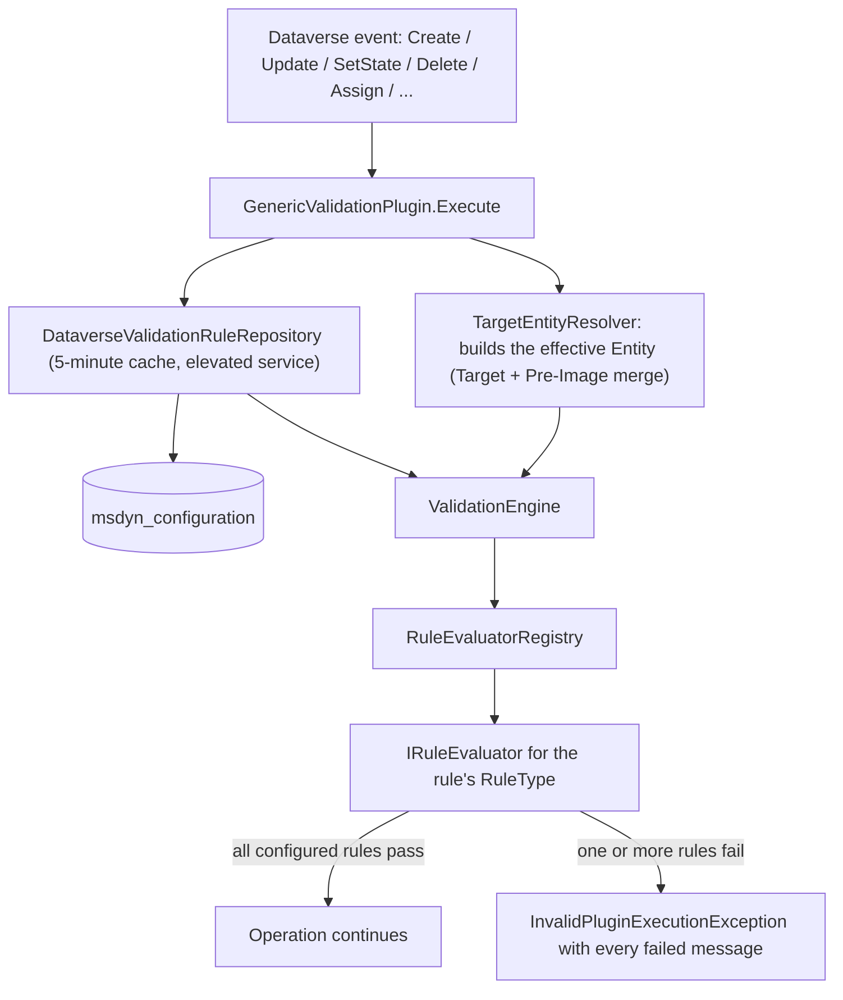

# DevEn.Xrm.EntityValidation

A generic, configuration-driven Dataverse plugin that validates any entity's data against rules stored
in Dataverse itself, with no entity-specific code and no redeployment required to add, change or disable a rule.

**At a glance**

| | |
|---|---|
| Target framework | .NET Framework 4.6.2 (`net462`) — the supported Dataverse plugin sandbox target |
| Configuration storage | Out-of-the-box `msdyn_configuration` ("Configuration") table |
| Built-in rule types | 12 (see [Rule type reference](#rule-type-reference)) |
| Configuration granularity | One JSON array per target entity, one object per rule (field/message/stage/type/parameters) |
| Missing configuration | Silently skipped (no rules configured = no validation, not an error) |
| Broken configuration | Fails loudly with a clear error (malformed JSON is a real mistake to fix) |
| Plugin class | `DevEn.Xrm.EntityValidation.Plugin.GenericValidationPlugin` — one class, many step registrations |

## Table of contents

- [Overview](#overview)
- [Architecture](#architecture)
- [Configuration model](#configuration-model)
- [Rule type reference](#rule-type-reference)
- [Supported Dataverse messages and pipeline stages](#supported-dataverse-messages-and-pipeline-stages)
- [Registering the plugin](#registering-the-plugin)
- [Error handling and validation messages](#error-handling-and-validation-messages)
- [Caching](#caching)
- [Security model](#security-model)
- [Extending: adding a new rule type](#extending-adding-a-new-rule-type)
- [Solution structure](#solution-structure)
- [Requirements](#requirements)
- [Building and testing](#building-and-testing)

## Overview

Traditionally, validating a Dataverse entity's fields means writing (and maintaining, and redeploying) a
dedicated plugin per entity. `DevEn.Xrm.EntityValidation` replaces that with a single generic plugin class
that is registered once per entity/message/stage combination and reads *what* to validate from a
Dataverse configuration row at execution time.

Design principles:

- **No entity-specific code.** The same assembly and the same plugin class validate every entity; only
  the configuration changes.
- **Configuration lives in Dataverse**, editable without a deployment (a JSON array of rule objects on a
  `msdyn_configuration` row).
- **Fail open on absence, fail closed on mistakes.** An entity with no configuration row behaves as if the
  plugin weren't registered at all. An entity with a configuration row that contains invalid JSON blocks
  the operation with a clear error, because that is an actual configuration bug.
- **Extensible by construction.** New rule types are added by implementing one interface and registering
  one class; nothing else in the pipeline needs to change.

## Architecture



| Component | Responsibility |
|---|---|
| `Plugin.GenericValidationPlugin` | Public `IPlugin` entry point. Wires the other components together and translates exceptions into safe, user-facing messages. |
| `Plugin.LocalPluginContext` | Exposes the platform-provided services, split into an elevated system service (configuration reads) and the calling user's own service (rule evaluation). |
| `Plugin.TargetEntityResolver` | Rebuilds the "effective" `Entity` to validate from whichever shape the current message uses (`Target` as `Entity`, `Target` as `EntityReference`, or `EntityMoniker`), merged with the Pre-Image when registered. |
| `Repository.DataverseValidationRuleRepository` | Reads and parses the JSON rules configured for a given target entity, with caching and the silent-fallback/loud-failure behavior described below. |
| `Repository.ValidationRuleCache` | Static, thread-safe, 5-minute in-memory cache of parsed rules, keyed per organization and entity. |
| `Engine.ValidationEngine` | Evaluates every rule matching the current entity/message/stage and aggregates all failures into a single exception. |
| `Validation.RuleEvaluatorRegistry` | Case-insensitive lookup from a rule's `ruleType` string to its `IRuleEvaluator` implementation. |
| `Validation.IRuleEvaluator` implementations | One class per rule type; see [Rule type reference](#rule-type-reference). |

## Configuration model

Rules are stored on the out-of-the-box
[`msdyn_configuration`](https://learn.microsoft.com/it-it/dynamics365/customer-service/develop/reference/entities/msdyn_configuration)
table (part of the Field Service / Universal Resource Scheduling solution). No custom table is required.

One row holds **all** the rules for a single target entity:

| Column | Value |
|---|---|
| `msdyn_name` | `ValidationRules:{entitylogicalname}` (e.g. `ValidationRules:account`) |
| `msdyn_value` | JSON array of rule objects (schema below) |
| `statecode` | Must be **Active**. Deactivating the row disables **all** validation for that entity — a whole-entity kill switch that doesn't require deleting or editing the JSON. |

### Fallback behavior

- **No matching row, or the table can't be queried at all** (e.g. Field Service / Universal Resource
  Scheduling isn't installed in this environment, or the row is deactivated): validation is **silently
  skipped** for that entity. This is treated as "no rules configured", not as an error, so the plugin never
  blocks Create/Update/etc. on entities that simply haven't been set up yet. A *failed* query (throttling,
  timeout, missing privileges...) skips validation for that execution only and is deliberately **not
  cached**, so a transient error can't leave an entity unvalidated for the whole cache window.
- **A row exists but `msdyn_value` is not valid JSON, or contains an element that isn't a JSON object, or an
  invalid `stage` value**: this throws a `ValidationConfigurationException`, surfaced to the user as a
  generic `InvalidPluginExecutionException` (details go to the trace log). This is an actual mistake to fix,
  so it fails loudly instead of being swallowed.

### Rule object schema

Each element of the `msdyn_value` JSON array:

| Key | Type | Required | Default | Description |
|---|---|---|---|---|
| `id` | string | no | `"{entity}#{index}"` | Free-form identifier used in trace logs and internal error wrapping. |
| `message` | string | yes | — | Dataverse message the rule applies to (`Create`, `Update`, `SetState`, `SetStateDynamicEntity`, `Delete`, `Assign`, ...), matched case-insensitively. |
| `stage` | string | yes | — | One of `PreValidation`, `PreOperation`, `PostOperation` (matched case-insensitively). |
| `field` | string | usually | — | Logical name of the attribute the rule is about. Optional for the rule types that carry their fields in `parameters` (`AtLeastOneOf`, `Expression`); every other rule type fails with a configuration error when it's missing. |
| `ruleType` | string | yes | — | One of the built-in types below, or a custom one registered in `RuleEvaluatorRegistry`. |
| `parameters` | object | no | `{}` | Rule-type-specific parameters, see [Rule type reference](#rule-type-reference). |
| `errorMessage` | string | no | auto-generated | Message shown to the end user when the rule fails. |
| `isActive` | boolean | no | `true` | Set to `false` to disable a single rule without removing it. |
| `executionOrder` | integer | no | `0` | Ascending sort order among rules matching the same message/stage. Rules sharing the same value keep the order they appear in the JSON array. |

### Example row

```json
[
  {
    "id": "account-name-required",
    "message": "Create",
    "stage": "PreOperation",
    "field": "name",
    "ruleType": "Required",
    "errorMessage": "The account name is required.",
    "executionOrder": 0
  },
  {
    "id": "account-email-format",
    "message": "Create",
    "stage": "PreOperation",
    "field": "emailaddress1",
    "ruleType": "Regex",
    "parameters": { "pattern": "^[^@\\s]+@[^@\\s]+\\.[^@\\s]+$" },
    "errorMessage": "Enter a valid email address.",
    "executionOrder": 1
  }
]
```

This row would be created with `msdyn_name = "ValidationRules:account"`, using whichever tool your
environment allows (Dataverse Web API, XrmToolBox, a Power Automate flow...) — `msdyn_configuration` is
typically not exposed in a default model-driven app sitemap.

## Rule type reference

Unless noted otherwise, a rule whose target field is `null`/absent is treated as **satisfied** (`true`):
compose with a separate `Required` rule on the same field to also enforce its presence.

| Rule type | Purpose | Parameters |
|---|---|---|
| `Required` | Field must be present and not blank | none |
| `Regex` | Text must match a pattern | `pattern` (required) |
| `Range` | Numeric value within bounds | `min`, `max` (both optional) |
| `StringLength` | Text length within bounds | `minLength`, `maxLength` (both optional) |
| `AllowedValues` | Value must be one of a fixed list | `values` (required array), `caseSensitive` (optional, default `false`) |
| `FieldComparison` | Compare the field to another field on the same record | `compareToAttribute` (required), `operator` (required) |
| `DateRange` | Date/time value within bounds | `min`, `max` (both optional, absolute or relative) |
| `Expression` | Evaluate a boolean/arithmetic expression over the record's fields | `expression` (required) |
| `AtLeastOneOf` | At least N of several fields must be populated | `fields` (required array), `minimumRequired` (optional, default `1`) |
| `Conditional` | Apply another rule only if a condition holds | `when` (required), `then` (required) |
| `Uniqueness` | No other record may share this field's value | `scopeFields` (optional array) |
| `RelatedRecordState` | A lookup must point to a record in a given state | `expectedState` (optional, default `"Active"`) |

### Required

No parameters. Fails when the value is `null`, or an empty/whitespace-only string.

```json
{ "message": "Create", "stage": "PreOperation", "field": "name", "ruleType": "Required",
  "errorMessage": "The account name is required." }
```

### Regex

`{"pattern": "..."}`. Matched with a 2-second timeout (a malformed/catastrophic pattern can never hang the
plugin); an invalid pattern or a timeout throws `ValidationConfigurationException`.

```json
{ "message": "Create", "stage": "PreOperation", "field": "emailaddress1", "ruleType": "Regex",
  "parameters": { "pattern": "^[^@\\s]+@[^@\\s]+\\.[^@\\s]+$" },
  "errorMessage": "Enter a valid email address." }
```

### Range

`{"min": number, "max": number}` (both optional). Accepts `Money`, `decimal`, `int`, `long` and `double`
fields; any other type throws `ValidationConfigurationException`.

```json
{ "message": "Update", "stage": "PreOperation", "field": "creditlimit", "ruleType": "Range",
  "parameters": { "min": 0, "max": 1000000 },
  "errorMessage": "Credit limit must be between 0 and 1,000,000." }
```

### StringLength

`{"minLength": int, "maxLength": int}` (both optional). Only applies to text fields; any other type throws.

```json
{ "message": "Create", "stage": "PreOperation", "field": "accountnumber", "ruleType": "StringLength",
  "parameters": { "minLength": 5, "maxLength": 20 },
  "errorMessage": "Account number must be between 5 and 20 characters." }
```

### AllowedValues

`{"values": ["A","B"], "caseSensitive": false}`. Values are compared against the field's textual
representation (covers text, option sets, money and other simple types via their textual form); a value
that can't be converted to non-empty text throws.

```json
{ "message": "Create", "stage": "PreOperation", "field": "new_region", "ruleType": "AllowedValues",
  "parameters": { "values": ["EMEA", "AMER", "APAC"], "caseSensitive": false },
  "errorMessage": "Region must be one of EMEA, AMER, APAC." }
```

### FieldComparison

`{"compareToAttribute": "...", "operator": "Equal|NotEqual|GreaterThan|GreaterThanOrEqual|LessThan|LessThanOrEqual"}`.
Supports numeric/numeric, date/date, or strict text/text (string or option set only) pairs; comparing
incompatible types throws `ValidationConfigurationException` rather than silently succeeding.

```json
{ "message": "Update", "stage": "PreOperation", "field": "estimatedclosedate", "ruleType": "FieldComparison",
  "parameters": { "compareToAttribute": "createdon", "operator": "GreaterThanOrEqual" },
  "errorMessage": "The estimated close date cannot be before the creation date." }
```

### DateRange

`{"min": "...", "max": "..."}` (both optional). Each bound accepts an absolute ISO-8601 date/time, or a
relative token evaluated against UTC "now": `Today`, `Now`, `Today+Nd`/`Today-Nd` (days),
`Today+Nm`/`Today-Nm` (months), `Today+Ny`/`Today-Ny` (years). Only applies to date/time fields.

```json
{ "message": "Create", "stage": "PreOperation", "field": "new_contractstartdate", "ruleType": "DateRange",
  "parameters": { "min": "Today", "max": "Today+365d" },
  "errorMessage": "The contract start date must be within the next year." }
```

### Expression

`{"expression": "..."}`. Evaluates a small boolean/arithmetic expression against the record's fields —
a generalization of `FieldComparison` and `DateRange` for the compound conditions those two can't express
in a single rule: offset comparisons between two fields, AND/OR combinations, and arithmetic between fields.

Grammar, low to high precedence: `||`, `&&`, unary `!`, non-chaining comparisons
(`== != > >= < <=`), additive (`+ -`), multiplicative (`* /`), unary `-`, and parenthesized
sub-expressions. Field names are bare identifiers (e.g. `creditlimit`); text literals use `'...'` or
`"..."` (single quotes are recommended since `expression` itself sits inside a JSON string); `Today`,
`Now`, `Today+30d`, `Today-1y` and absolute **ISO-8601** dates in quotes (`'2026-01-01'`) are recognized as
dates; anything else in quotes stays text, so ordinary values are never mistaken for dates; `true`/`false`
are case-insensitive boolean literals.

Semantics:

- Comparisons reuse the exact type-compatibility rules as `FieldComparison` (numeric/numeric,
  date/date, or strict text/text); comparing incompatible types throws `ValidationConfigurationException`.
- `date ± number` offsets the date by that many days; `date − date` yields the numeric day difference;
  `date + date` throws; dividing by zero throws.
- If either side of a comparison is `null`/absent, that comparison is vacuously satisfied (`true`) —
  consistent with every other rule type's "absent field ⇒ satisfied" convention.
- The expression's overall result must be boolean: an expression that evaluates to a raw number, string,
  date, or an absent field used directly (not through a comparison) throws
  `ValidationConfigurationException` rather than guessing.
- Guarded against pathological configuration: the `expression` string is capped at 500 characters, and
  nesting (parentheses, unary operator chains) is capped at 20 levels; both throw
  `ValidationConfigurationException` when exceeded.

```json
{ "message": "Update", "stage": "PreOperation", "field": "fieldA", "ruleType": "Expression",
  "parameters": { "expression": "fieldA == fieldB" },
  "errorMessage": "Field A and Field B must match." }
```

```json
{ "message": "Create", "stage": "PreOperation", "field": "somedate", "ruleType": "Expression",
  "parameters": { "expression": "somedate >= Today" },
  "errorMessage": "The date cannot be in the past." }
```

```json
{ "message": "Update", "stage": "PreOperation", "field": "dateA", "ruleType": "Expression",
  "parameters": { "expression": "dateA <= dateB + 30" },
  "errorMessage": "Date A must be within 30 days of Date B." }
```

```json
{ "message": "Create", "stage": "PreOperation", "field": "paese", "ruleType": "Expression",
  "parameters": { "expression": "tipo == 'Cliente' && paese == 'IT'" },
  "errorMessage": "Italian customers only." }
```

```json
{ "message": "Update", "stage": "PreOperation", "field": "importo", "ruleType": "Expression",
  "parameters": { "expression": "importo <= creditlimit * 1.1" },
  "errorMessage": "Amount exceeds the credit limit by more than 10%." }
```

### AtLeastOneOf

`{"fields": ["...", "..."], "minimumRequired": 1}`. Counts how many of the listed fields are populated
(non-null, non-blank strings) and requires at least `minimumRequired`. The rule's own `field` value is not
evaluated for this rule type and can be omitted — since the rule spans several fields, use it (if you want)
as a descriptive label, e.g. the field names joined by `;`.

```json
{ "message": "Create", "stage": "PreOperation", "field": "emailaddress1;telephone1;mobilephone",
  "ruleType": "AtLeastOneOf",
  "parameters": { "fields": ["emailaddress1", "telephone1", "mobilephone"], "minimumRequired": 1 },
  "errorMessage": "Enter at least one contact method (email, phone or mobile)." }
```

### Conditional

`{"when": {"field": "...", "operator": "Equal|NotEqual", "value": "..."}, "then": {"ruleType": "...", "parameters": {...}}}`.
Evaluates `when` first (text comparison, case-insensitive; `operator` defaults to `Equal`); if it doesn't
hold, the rule is satisfied and `then` is never evaluated. If it holds, delegates to the `then.ruleType`
evaluator, applied to this same rule's `field`/message/stage/errorMessage. This is how "required if",
"range if", etc. are built without a dedicated evaluator per combination — `then.ruleType` can be any
registered rule type, including another `Conditional` (nesting is capped at 5 levels to guard against a
self-referential configuration mistake).

```json
{ "message": "Create", "stage": "PreOperation", "field": "new_taxid", "ruleType": "Conditional",
  "parameters": {
    "when": { "field": "customertypecode", "operator": "Equal", "value": "3" },
    "then": { "ruleType": "Required", "parameters": {} }
  },
  "errorMessage": "Tax ID is required for this customer type." }
```

### Uniqueness

`{"scopeFields": ["...", "..."]}` (optional). Runs a live query against Dataverse (in the calling user's
security context) for other records of the same entity sharing this field's value; when updating an
existing record, the record itself is excluded from the check. `scopeFields` narrows the check to records
that also share the same value on those additional fields (e.g. "unique per parent account").

```json
{ "message": "Create", "stage": "PreOperation", "field": "new_externalcode", "ruleType": "Uniqueness",
  "parameters": { "scopeFields": ["parentaccountid"] },
  "errorMessage": "This external code is already used by another account under the same parent." }
```

### RelatedRecordState

`{"expectedState": "Active"}` (or `"Inactive"`, default `"Active"`). Only applies to lookup fields; runs a
live `Retrieve` (in the calling user's security context) against the referenced record's `statecode`. If
the related record can't be read (deleted, no access...), the rule is **not** satisfied, since its state
cannot be confirmed.

```json
{ "message": "Create", "stage": "PreOperation", "field": "parentaccountid", "ruleType": "RelatedRecordState",
  "parameters": { "expectedState": "Active" },
  "errorMessage": "The parent account must be active." }
```

> `Uniqueness` and `RelatedRecordState` are the only two built-in rule types that require Dataverse access;
> both throw a clear `ValidationConfigurationException` (instead of a `NullReferenceException`) if no
> `IOrganizationService` is available when they need one.

## Supported Dataverse messages and pipeline stages

`TargetEntityResolver` knows how to build the effective entity for:

| Message | Shape of `InputParameters` |
|---|---|
| `Create`, `Update` | `Target` is an `Entity` (for `Update`, merged with the Pre-Image, if registered, since `Target` only contains the changed attributes) |
| `Delete`, `Assign` | `Target` is an `EntityReference`; full field values are only available from the Pre-Image, if registered |
| `SetState`, `SetStateDynamicEntity` | `EntityMoniker` is an `EntityReference`; the new state/status arrive separately in `State`/`Status`, not in `Target` |

Any other message throws `ValidationConfigurationException` if neither `Target` nor `EntityMoniker` is
present in `InputParameters`.

Pipeline stages (`Configuration.PipelineStage`), with the numeric values expected by
`IPluginExecutionContext.Stage` / the Plugin Registration Tool:

| Stage | Value |
|---|---|
| `PreValidation` | 10 |
| `PreOperation` | 20 |
| `PostOperation` | 40 |

Availability of a given stage for a given message is governed by the Dataverse platform itself, not by
this library.

## Registering the plugin

1. Build the solution (Release configuration recommended) to produce `DevEn.Xrm.EntityValidation.dll`.
2. Register the assembly with the Plugin Registration Tool, **Isolation Mode: Sandbox**.
3. For each entity/message/stage combination that needs validation, register a new step on
   `DevEn.Xrm.EntityValidation.Plugin.GenericValidationPlugin`:
   - **Message**: the Dataverse message to validate (`Create`, `Update`, `SetState`, ...).
   - **Primary Entity**: the target entity's logical name.
   - **Stage**: matching a `stage` value used by the rules configured for that entity (Pre-validation /
     Pre-operation / Post-operation).
   - **Execution Mode**: Synchronous (validation must block the operation on failure).
   - **Unsecure Configuration** / **Secure Configuration**: leave both blank; the constructor accepts them
     only to match the standard signature recognized by the Plugin Registration Tool, neither is used.
4. If any configured rule reads a field that might not be part of the message's `Target` (any attribute on
   `Delete`/`Assign`/`SetState`, or an unchanged attribute on `Update`), register a **Pre-Image** named
   exactly `PreImage` on that step, including at least the attributes referenced by the configured rules.
   Without it those rules pass silently (an absent attribute counts as satisfied); the plugin traces a
   warning on every non-`Create` message with no Pre-Image registered, so check the trace log first when
   validation seems not to run.
5. Create (or activate) the `msdyn_configuration` row for the entity, as described in
   [Configuration model](#configuration-model). Without it, the step runs but finds no rules and does
   nothing.

The same plugin class is reused across every registration: "one or more generic plugins" is achieved as
"one class, many step registrations", never one class per entity.

## Error handling and validation messages

- **All** rules configured for the current entity/message/stage are evaluated in a single pass — not just
  the first one — so a user seeing a save error sees every problem at once instead of fixing them one at a
  time across repeated attempts.
- If one or more rules fail, a single `InvalidPluginExecutionException` is thrown, joining every distinct
  configured `errorMessage` with a newline.
- If a rule's `errorMessage` is blank, a default is generated:
  `Field '{attributeLogicalName}' failed validation rule '{ruleType}'.`
- Configuration mistakes (an unknown `ruleType`, a missing required parameter, a rule applied to the wrong
  field type...) never pass silently, and never stop the pass at the first one either: every misconfigured
  rule is collected and they are all reported together, so an administrator fixes them in one round instead
  of one per save attempt. A configuration error takes precedence over validation messages (fail closed).
- The end user only sees a generic
  "The validation configuration for this record is not valid. Contact your system administrator." message:
  rule ids, field logical names, regex patterns and expression text stay in the server-side trace log.
- Any unexpected exception is traced in full server-side (via `ITracingService`) but never shown to the end
  user with internal details: it is translated into a generic
  "An unexpected error occurred during validation. Contact your system administrator." message.

## Caching

`ValidationRuleCache` is a static, process-wide, thread-safe cache (`ConcurrentDictionary` of `Lazy`
entries) of the parsed rules per organization and target entity:

- Cache key: organization id + target entity logical name (lowercased) — safe for a sandbox worker process
  that can serve multiple organizations.
- Entries expire after **5 minutes**; a change to a `msdyn_configuration` row can take up to 5 minutes to
  take effect.
- If the underlying query/parsing fails (a transient Dataverse error, or malformed JSON), the faulted entry
  is evicted immediately instead of caching the failure for the full TTL, so both a retry and a
  configuration fix take effect on the very next call.

## Security model

> **This component is a data-quality guardrail, not a security control.** It only runs where a step is
> registered, it deliberately fails open when its configuration can't be read, and rules are cached for up
> to 5 minutes. Anything that must hold unconditionally (privileges, tenant isolation, invariants a
> malicious caller must not be able to bypass) has to be enforced by Dataverse security, an alternate key,
> or another mechanism that cannot be skipped — not here.

- **Configuration reads** (`DataverseValidationRuleRepository`) always use an elevated, system
  `IOrganizationService` (`LocalPluginContext.SystemOrganizationService`): a user without read access to
  `msdyn_configuration` is never blocked by that.
- **Rule evaluation**, including the live Dataverse queries made by `Uniqueness` and `RelatedRecordState`,
  uses the calling user's own `IOrganizationService` (`LocalPluginContext.UserOrganizationService`), so
  those queries respect the user's actual security roles, field-level security and row-level access.

## Extending: adding a new rule type

1. Add a class under `Validation/` implementing `IRuleEvaluator`.
2. Expose a unique `RuleType` string (matched case-insensitively by the registry).
3. Implement `IsValid`, returning `true`/`false` for the actual outcome and throwing
   `ValidationConfigurationException` for configuration mistakes (missing/invalid parameters, wrong field
   type, ...).
4. Register an instance in `RuleEvaluatorRegistry.CreateDefault()`.
5. Add unit tests under `DevEn.Xrm.EntityValidation.Tests/Validation/`.

No other component needs to change: the repository, engine and plugin are all rule-type-agnostic.

## Solution structure

```
DevEn.Xrm.EntityValidation.slnx
DevEn.Xrm.EntityValidation/                Main plugin assembly (net462, class library)
  Configuration/                           PipelineStage enum, ValidationConfigurationException
  Model/                                   ValidationRuleDefinition
  Repository/                              IValidationRuleRepository, DataverseValidationRuleRepository, ValidationRuleCache
  Validation/                              IRuleEvaluator, all rule evaluators, RuleEvaluatorRegistry, shared helpers
  Engine/                                  ValidationEngine
  Plugin/                                  GenericValidationPlugin, LocalPluginContext, TargetEntityResolver
DevEn.Xrm.EntityValidation.Tests/          MSTest + FakeXrmEasy test project, mirroring the folder layout above
```

## Requirements

| Component | Version |
|---|---|
| Target framework | .NET Framework 4.6.2 (`net462`) |
| Microsoft.CrmSdk.CoreAssemblies | 9.0.2.60 |
| Newtonsoft.Json | 13.0.3 |
| Dataverse environment | Field Service / Universal Resource Scheduling solution installed (provides the `msdyn_configuration` table) |

Test project only:

| Component | Version |
|---|---|
| Microsoft.NET.Test.Sdk | 17.11.1 |
| MSTest.TestAdapter / MSTest.TestFramework | 3.6.4 |
| FakeXrmEasy.9 | 1.58.1 (free/MIT v1.x line, .NET Framework compatible) |

## Building and testing

From the repository root:

```powershell
dotnet build DevEn.Xrm.EntityValidation.slnx
dotnet test DevEn.Xrm.EntityValidation.slnx
```

Both the main assembly and the test project target `net462`; no additional runtime needs to be installed
beyond the .NET Framework 4.6.2 developer pack and the .NET SDK used to drive `dotnet build`/`dotnet test`.
